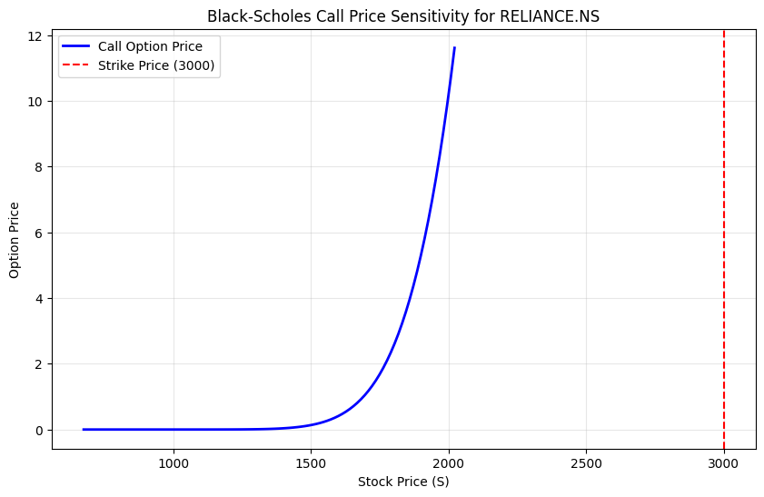

# Black-Scholes Option Pricing & Visualization

## Project Overview
This project implements the **Black-Scholes-Merton model** to calculate the theoretical price of European Call and Put options. It is designed for the **Banking and Financial Analytics** domain, focusing on real-time data integration and risk sensitivity.

## Features
- **Live Data Integration:** Fetches real-time equity prices from the NSE using the `yfinance` API.
- **Dynamic Volatility:** Calculates annualized historical volatility ($\sigma$) based on 1-year daily log returns.
- **Visual Analytics:** Includes a sensitivity plot (Greeks) to show how option prices move relative to the underlying asset.

## Visual Output

## Technical Stack
- **Python** (NumPy, Pandas, SciPy, Matplotlib)
- **Financial Analytics** (Option Greeks, Log Returns, BSM Model)

## How to Run
1. Clone this repository.
2. Install dependencies: `pip install -r requirements.txt`
3. Open `options_pricing.ipynb` in VS Code or Jupyter Notebook.

### Analytical Conclusion: Price Sensitivity
The generated graph illustrates that as the **Stock Price ($S$)** increases, the **Call Option Price** rises at an accelerating rate. This curvature is known as **Gamma**, representing the rate of change in **Delta**. When the stock price is far below the Strike Price ($K$), the option is "Out of the Money" and the price remains flat. As $S$ surpasses $K$, the option gains intrinsic value, and the slope of the curve approaches 1.0, signifying that the option price will eventually move dollar-for-dollar with the underlying asset.
